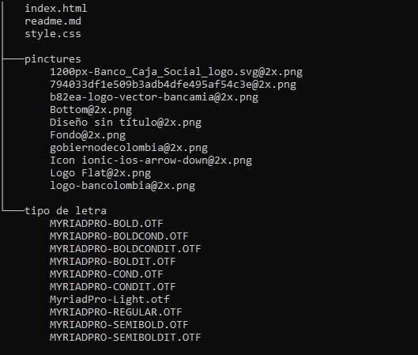

## ° INGRESO SOLIDARIO

Este repositorio contiene el código fuente para una página web informatica sobre el programa de ingreso solidario, una ayuda económica del gobierno colombiano para las familias afectadas por la pandemia de COVID-19.

## Descripción

La página web cuenta con cuatro opciones principales:

1. **Consultas** : Incluye un formulario para que los usuarios verifiquen su estado en el programa.

2. **¿Qué es?** : Explica en detalle qué es el ingreso solidario y quienes pueden beneficiarse.

3. **Entrega** : Detalla las etapas de entrega del subsidio y los bancos autorizados para la distribucción.

4. **Preguntas Frecuentes** : Espacio dedicado para  responder las dudas de los usuarios.

Esta página incluye una barra fija junto al logotipo del gobierno más varias opciones que permitiran una mejor navegación.

## Tecnologías Utilizadas

* HTML5
* CSS3

##  Estructura del proyecto

## Caracteristicas del diseño
 
* Diseño responsivo utilizando  unidades  vw(viewport width) para las dimensiones.
* Barra de navegación fija en la parte superior.
* Uso de imagen de fondo, logotipos de bancos  autorizados y del gobierno.
* Media queris para adaptacion de pantallas de iphone 14 pro max(430px - 932px)

## Instrucciones de uso

1.  Abrir el archivo index.html en un servidor  compatible.

2. Descarga y abre los archivos en tu maquina local. 

## Créditos
 Este proyecto fue desarrollado por Yurley Botello
 Garcia como taller de refuerzo y practica en HTML y CSS.