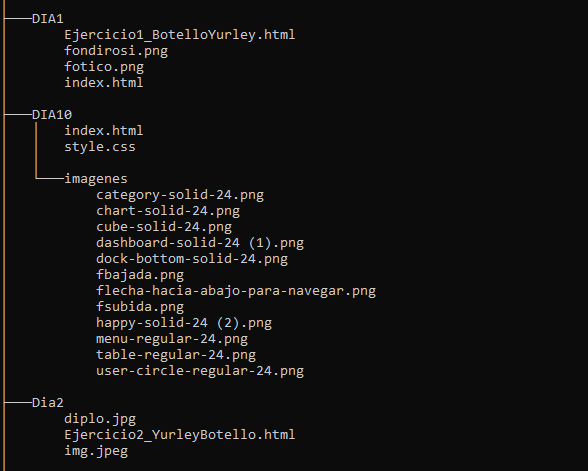
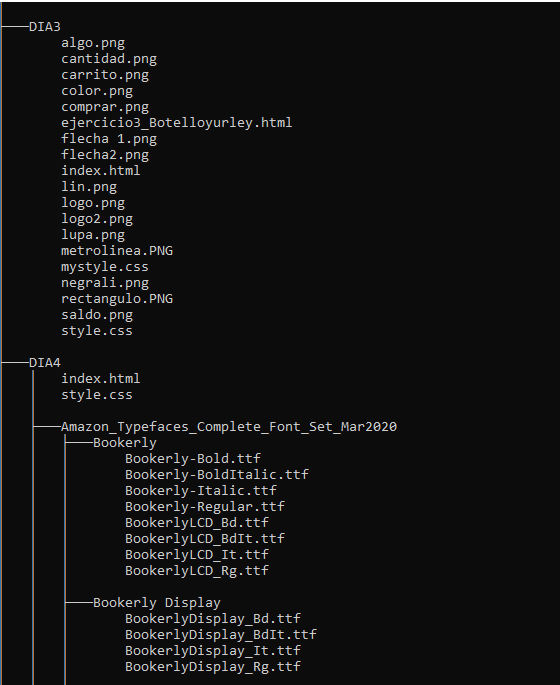
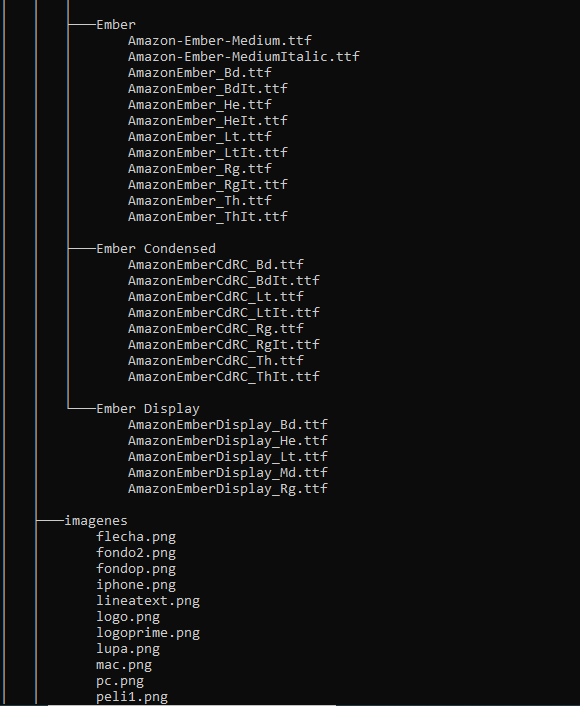
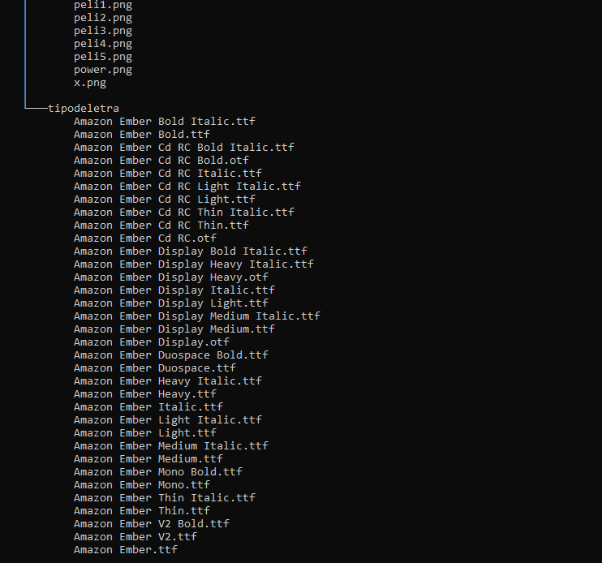
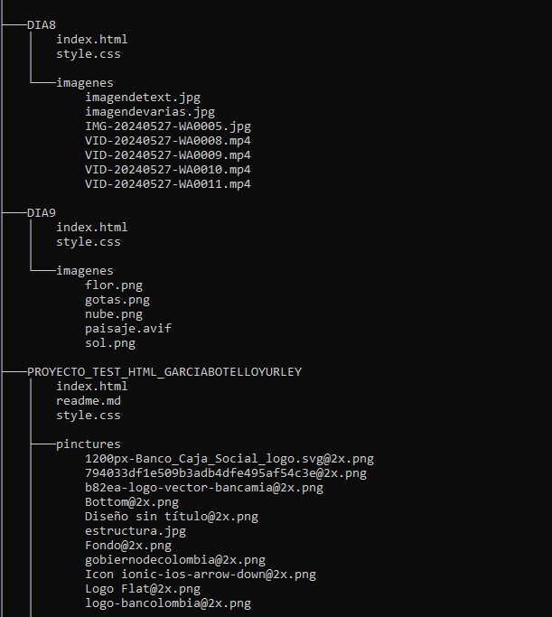
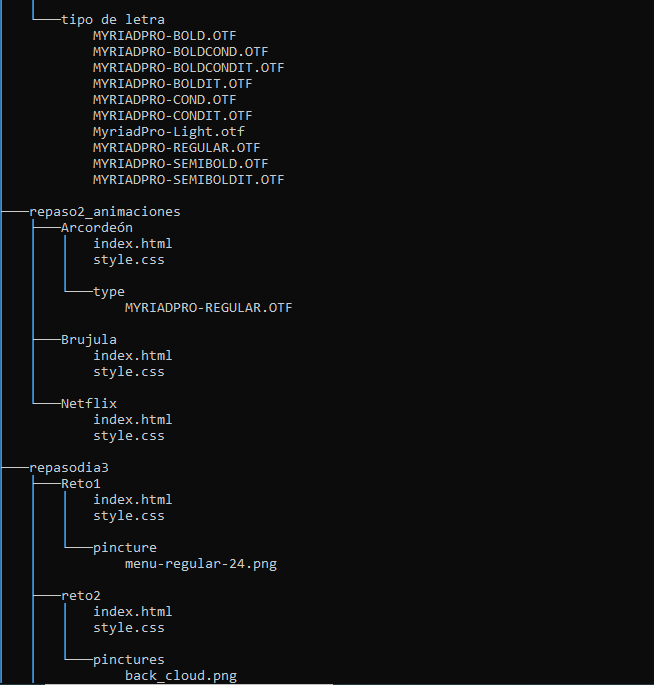
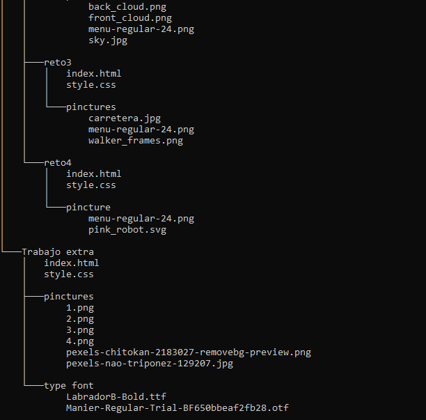

# HTML Y CSS
 
Cuenta con varios proyectos realizados en Html y Css

## Tabla De Contenido
| Índice | Título |
|--|------|
| 1 | DIA1 | 
| 2 | Dia2 |
| 3 | Dia3 |
| 4 | Dia4 |
| 5 | Dia5 |
| 6 | Dia6 |
| 7 | Dia7 |
| 8 | Dia8 |
| 9 | Dia9 |
| 10 | Dia10 |
| 11 | proyecto test html |
| 12 | repaso2_animaciones |
| 13 | repasodia3 |
| 14 | Trabajo extra |

## Instalación
 Deberas ejecutar el siguiente comando para clonar el repositorio y ver cada uno de los proyectos  desde tu maquina local:
 
Gith Bash

~~~ 
git clone  "link del repositorio"
~~~
al hacer esto se descargará  los datos del repositorio. puedes usar visual studio code  y descargar la extensión live server para abrir los archivos index de cada carpeta.

 ## Tecnología utilizadas

 * HTML5
 * CSS3

 ## Estructura de Proyecto

## Crédito 
Cada uno de estos proyectos fueron realizados por Yurley Botello.
   
